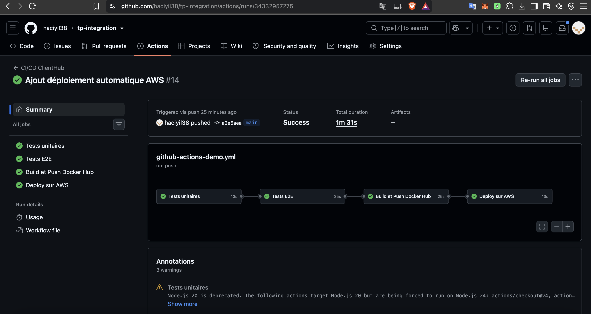
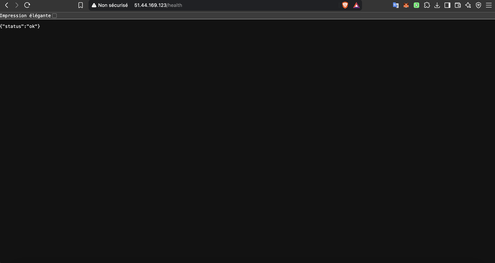
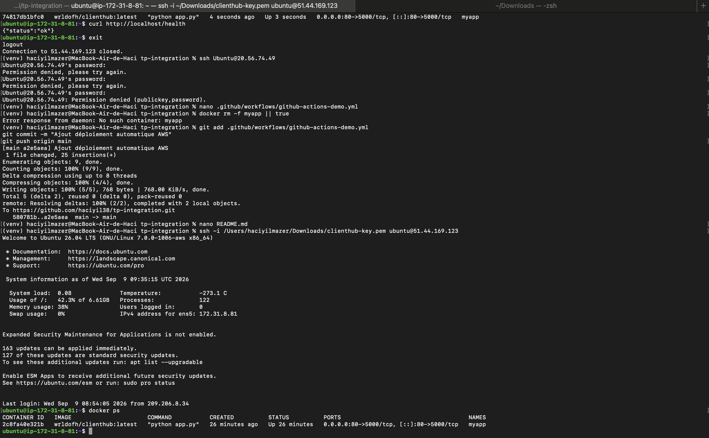

# ClientHub – CI/CD avec Docker, GitHub Actions et AWS

## 1. Présentation

ClientHub est une petite application web développée avec Flask et conteneurisée avec Docker.

L'objectif du projet est de mettre en place une chaîne CI/CD permettant d'automatiser :

- les tests unitaires ;
- les tests End-to-End (E2E) ;
- la construction de l'image Docker ;
- la publication de l'image sur Docker Hub ;
- le déploiement automatique sur une machine virtuelle AWS ;
- la vérification du bon fonctionnement de l'application.

Le pipeline est déclenché automatiquement à chaque `push` sur la branche `main`.

Aucune action manuelle n'est nécessaire après le push.

---

## 2. Architecture du projet

```text
tp-integration/
│
├── app.py
├── requirements.txt
├── test_app.py
├── tests/
│   └── test_e2e.py
├── Dockerfile
├── .gitignore
├── README.md
│
└── .github/
    └── workflows/
        └── github-actions-demo.yml
```

---

## 3. Application Flask

L'application est développée avec Flask.

Elle expose deux endpoints.

### GET /

Cet endpoint permet de vérifier que l'application fonctionne.

Réponse :

```text
ClientHub API fonctionne !
```

### GET /health

Cet endpoint permet de vérifier l'état de santé de l'application.

Réponse :

```json
{
  "status": "ok"
}
```

L'application Flask écoute sur le port `5000` dans le conteneur Docker.

---

## 4. Tests unitaires

Les tests unitaires sont réalisés avec le module `unittest` de Python.

Le fichier `test_app.py` vérifie notamment :

- la disponibilité de l'endpoint `/health` ;
- le code HTTP retourné ;
- le contenu de la réponse JSON ;
- la disponibilité de l'endpoint `/`.

Commande utilisée :

```bash
python -m unittest -v test_app.py
```

Résultat obtenu localement :

```text
Ran 2 tests
OK
```

Les tests unitaires sont également exécutés automatiquement dans GitHub Actions.

Si un test échoue, le job est considéré comme échoué et les étapes suivantes ne peuvent pas continuer.

---

## 5. Tests E2E

Les tests End-to-End utilisent `pytest` et `requests`.

Ils simulent des requêtes HTTP vers l'application.

Les tests vérifient :

- la disponibilité de l'application ;
- l'endpoint `/health` ;
- l'endpoint `/`.

Commande utilisée :

```bash
pytest tests/test_e2e.py -v
```

Résultat obtenu localement :

```text
2 passed
```

Dans GitHub Actions, le conteneur Docker est démarré avant l'exécution des tests E2E.

Les tests E2E doivent être validés avant de pouvoir construire et publier l'image Docker.

---

## 6. Conteneurisation avec Docker

L'application est conteneurisée grâce au fichier `Dockerfile`.

```dockerfile
FROM python:3.12-slim

WORKDIR /app

COPY requirements.txt .

RUN pip install --no-cache-dir -r requirements.txt

COPY app.py .

EXPOSE 5000

CMD ["python", "app.py"]
```

### Construction de l'image

```bash
docker build -t clienthub .
```

### Lancement local

Le port `5002` de la machine locale est associé au port `5000` du conteneur :

```bash
docker run -d -p 5002:5000 --name clienthub clienthub
```

### Vérification

```bash
curl http://localhost:5002/health
```

Réponse :

```json
{
  "status": "ok"
}
```

---

## 7. Docker Hub

Après validation des tests unitaires et des tests E2E, GitHub Actions construit automatiquement l'image Docker et la publie sur Docker Hub.

Image utilisée :

```text
wrldofh/clienthub:latest
```

Le workflow utilise des GitHub Secrets pour protéger les identifiants Docker Hub :

```text
DOCKERHUB_USERNAME
DOCKERHUB_TOKEN
```

Aucun mot de passe ou token Docker Hub n'est présent dans le dépôt.

---

## 8. Machine virtuelle AWS

Le déploiement est réalisé sur une instance EC2 AWS utilisant Ubuntu.

Docker est installé sur la machine virtuelle.

L'application est exécutée dans un conteneur nommé :

```text
myapp
```

Le port `80` de la machine virtuelle est redirigé vers le port `5000` du conteneur :

```text
80:5000
```

L'image est récupérée depuis Docker Hub avec :

```bash
docker pull wrldofh/clienthub:latest
```

Puis le conteneur est lancé avec :

```bash
docker run -d --name myapp -p 80:5000 wrldofh/clienthub:latest
```

### Vérification depuis la VM

```bash
curl http://localhost/health
```

Réponse :

```json
{
  "status": "ok"
}
```

### Vérification depuis l'extérieur

L'application est accessible via l'adresse IP publique de la VM :

```text
http://51.44.169.123/health
```

La réponse attendue est :

```json
{
  "status": "ok"
}
```

---

## 9. Pipeline GitHub Actions

Le pipeline est déclenché automatiquement lors d'un `push` sur la branche `main`.

```text
git push main
       │
       ▼
GitHub Actions
       │
       ▼
Tests unitaires
       │
       ▼
Tests E2E
       │
       ▼
Build Docker
       │
       ▼
Push Docker Hub
       │
       ▼
SSH vers AWS
       │
       ▼
Déploiement de l'application
       │
       ▼
Healthcheck
```

Le workflow est composé de quatre jobs.

### Job 1 – Tests unitaires

Le premier job :

1. récupère le code ;
2. installe Python ;
3. installe les dépendances ;
4. exécute les tests unitaires.

Commande :

```bash
python -m unittest -v test_app.py
```

---

### Job 2 – Tests E2E

Le deuxième job dépend du job de tests unitaires.

Il :

1. récupère le code ;
2. construit l'image Docker ;
3. démarre l'application ;
4. installe `requests` et `pytest` ;
5. exécute les tests E2E.

Commande :

```bash
pytest tests/test_e2e.py -v
```

Le job ne peut être exécuté que si les tests unitaires sont réussis.

---

### Job 3 – Build et Push Docker Hub

Le troisième job dépend des tests unitaires et des tests E2E.

```yaml
needs:
  - unit-tests
  - e2e-tests
```

Il :

1. se connecte à Docker Hub ;
2. construit l'image Docker ;
3. ajoute le tag `latest` ;
4. pousse l'image sur Docker Hub.

Image :

```text
wrldofh/clienthub:latest
```

L'image n'est donc publiée que si les tests précédents sont réussis.

---

### Job 4 – Déploiement AWS

Le quatrième job dépend du build et du push Docker.

Il se connecte à la VM AWS via SSH.

Les commandes exécutées sur la VM sont notamment :

```bash
docker pull wrldofh/clienthub:latest
docker rm -f myapp || true
docker run -d --name myapp -p 80:5000 wrldofh/clienthub:latest
```

Après le déploiement, GitHub Actions vérifie que l'application répond correctement :

```bash
curl --fail http://IP_DE_LA_VM/health
```

Si l'application retourne une erreur, le job est considéré comme échoué.

---

## 10. Sécurité

Aucun identifiant sensible n'est stocké directement dans le code.

Les informations sensibles sont stockées dans les GitHub Secrets.

Secrets utilisés :

```text
DOCKERHUB_USERNAME
DOCKERHUB_TOKEN
AWS_HOST
AWS_USER
AWS_SSH_KEY
```

Ces secrets sont utilisés directement par GitHub Actions.

La clé privée SSH et le token Docker Hub ne sont donc pas présents dans le dépôt GitHub.

---

## 11. Déploiement idempotent

Le déploiement est conçu pour être idempotent.

Le conteneur utilise toujours le même nom :

```text
myapp
```

Avant chaque nouveau déploiement, le conteneur existant est supprimé :

```bash
docker rm -f myapp || true
```

Puis une nouvelle version est lancée :

```bash
docker run -d --name myapp -p 80:5000 wrldofh/clienthub:latest
```

Le `|| true` permet au déploiement de continuer si le conteneur `myapp` n'existe pas encore.

Ainsi, relancer le workflow :

- ne crée pas plusieurs conteneurs ;
- ne nécessite pas d'action manuelle ;
- redéploie proprement l'application ;
- conserve toujours un seul conteneur nommé `myapp`.

---

## 12. Preuves du fonctionnement

### Pipeline GitHub Actions

Le pipeline a été exécuté avec succès.

Les quatre jobs sont validés :

- Tests unitaires
- Tests E2E
- Build et Push Docker Hub
- Deploy sur AWS



---

### Application déployée sur AWS

L'endpoint `/health` est accessible depuis l'extérieur et retourne :

```json
{
  "status": "ok"
}
```



---

### Conteneur Docker sur AWS

Le conteneur `myapp` est actif sur la machine virtuelle AWS.

Commande utilisée :

```bash
docker ps
```

Le port est exposé avec :

```text
0.0.0.0:80->5000/tcp
```



---

## 13. Résultat final

La chaîne CI/CD complète est maintenant automatisée :

```text
Push sur main
      ↓
Tests unitaires
      ↓
Tests E2E
      ↓
Build de l'image Docker
      ↓
Push sur Docker Hub
      ↓
Déploiement automatique sur AWS
      ↓
Healthcheck
```

Le déploiement est réalisé automatiquement après chaque push sur `main`.

L'application est disponible dans un conteneur Docker sur une machine virtuelle AWS et son bon fonctionnement est vérifié automatiquement par GitHub Actions.

---

## 14. Dépôt GitHub

Dépôt du projet :

https://github.com/haciyil38/tp-integration
